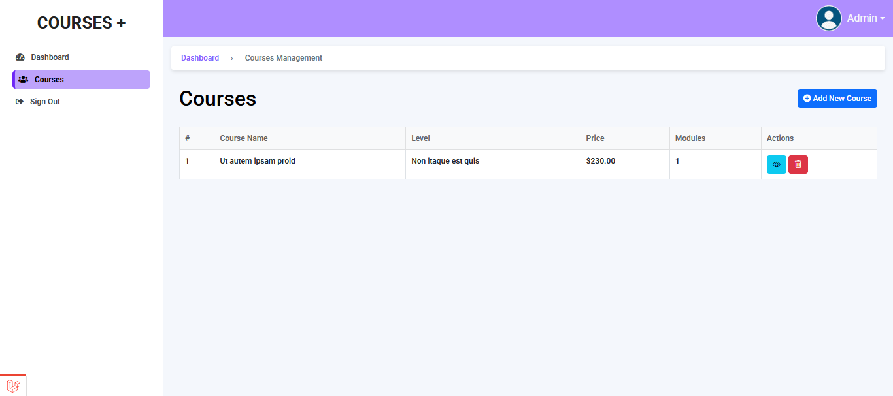

# **Course Builder Project**

A Laravel-based course creation platform that allows admins to create courses with multiple modules and contents, upload course images, and manage them via a clean Bootstrap UI.

---

## Live Link

-   https://dev-test.2ndsource.xyz/
-   Email: admin@gmail.com
-   Password: 12345678

## **Features**

-   **Course Management**

    -   Create courses with title, description, price, level, and category.
    -   Upload **course feature images** (with helper-based upload system).
    -   **Rich-text editor** for course summary (Summernote).

-   **Module & Content Management**

    -   Add multiple modules inside each course.
    -   Add multiple contents (video links, details) inside modules.
    -   **Collapsible accordion UI** for modules & contents.

-   **Course Listing**

    -   Simple **table view** with actions: **View**, **Edit**, **Delete**.
    -   **Modal view** for quick course details.

-   **Image Handling**

    -   Stored in `/public/assets/images/courses/`.
    -   Helper functions for **uploading**, **deleting**, and **retrieving URLs**.

-   **Alerts & Notifications**

    -   **SweetAlert2** Toasts for success and error notifications.

-   **Dark/Light Mode** toggle.

---

## **Tech Stack**

-   **Backend:** Laravel 11, PHP 8+
-   **Frontend:** Bootstrap 5, jQuery, SweetAlert2, Summernote
-   **Database:** MySQL
-   **Storage:** Local filesystem (public folder)

---

## **Screenshots**

|                               |
| :---------------------------: |
|          Show Course          |
|  |
|          Add Course           |
|  |
|        Details Course         |
|  |

---

## **Installation**

### **1. Clone the Repository**

```bash
git clone https://github.com/learnwithfair/course-builder.git
cd course-builder
```

### **2. Install Dependencies**

```bash
composer install
composer dump-autoload

```

### **3. Configure Environment**

Create a `.env` file:

```bash
cp .env.example .env
```

Update your database credentials:

```
DB_DATABASE=your_db
DB_USERNAME=your_user
DB_PASSWORD=your_password
```

### **4. Run Migrations**

```bash
php artisan migrate
or,
php artisan migrate:fresh --seed
```

### **6. Run the Server**

```bash
php artisan serve
```

Access at: [http://127.0.0.1:8000](http://127.0.0.1:8000)

---

## **Directory Structure**

```
app/
  Http/
    Controllers/
      CourseController.php
    Requests/
      StoreCourseRequest.php
    Helper/
      helper.php
  Models/
      Course.php
      Module.php
      Content.php

resources/
  views/
    courses/
      index.blade.php
      create.blade.php
      show.blade.php
      partials/details.blade.php

public/
  assets/images/courses/
```

---

## **Helper Functions**

Located at: `app/Http/Helper/helper.php`

-   `makeDirectory($path)` → Creates directory if missing.
-   `removeFile($path)` → Deletes a file.
-   `uploadImage($file, $location, $size = null, $old = null)` → Uploads image & replaces old one.
-   `filePath($folder)` → Returns folder path inside `/public/assets/images/`.
-   `getFile($folder, $filename)` → Returns full URL of stored file.

---

## **API/Views**

-   **List Courses:** `GET /courses`
-   **Create Course:** `GET /courses/create`
-   **Store Course:** `POST /courses`
-   **Show Course:** `GET /courses/{id}`
-   **Delete Course:** `DELETE /courses/{id}`

---

## **Future Enhancements**

-   **Drag & drop module/content reordering**.
-   **Thumbnail generation for images**.
-   **Advanced search & filtering** (DataTables).

---
